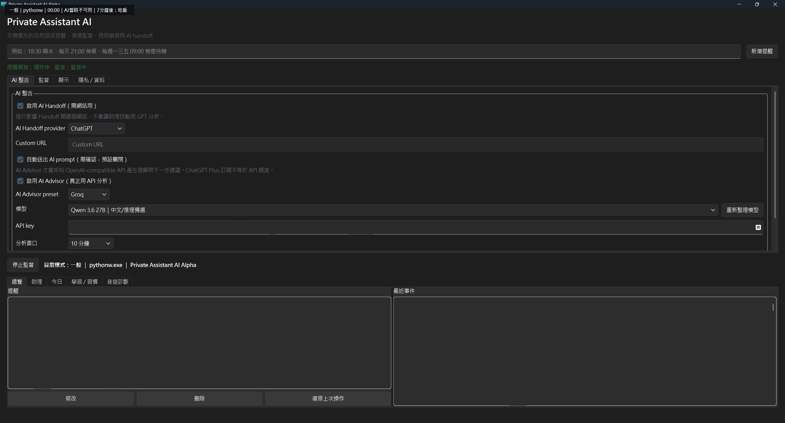

# Private Assistant AI

**A local-first, activity-aware Windows assistant with voice wake and reminders.**

**本機優先的 Windows 桌面助理，支援語音喚醒、提醒與活動情境感知。**

English | [繁體中文](README.zh-TW.md)

**Windows 64-bit · v0.1.0-alpha · Experimental pre-release**

### [Download for Windows (ZIP)](https://github.com/esther0510/private-assistant-ai/releases/download/v0.1.0-alpha/PrivateAssistantAI_v0.1.0-alpha_windows-x64.zip) · [Latest Alpha Release](https://github.com/esther0510/private-assistant-ai/releases/tag/v0.1.0-alpha)

Extract the whole ZIP, then open **PrivateAssistantAI.exe**. No Python installation or API key required. Voice models download on first use.

The interface and reminder commands are primarily **Traditional Chinese**. English documentation is available; full English command support is not yet available.

## At a glance

- **Reminders:** add, edit, delete and undo using text or voice.
- **Voice wake:** call your assistant's name, then speak a command; speech processing runs locally.
- **Activity-aware assistance:** use app/window context and idle state for reminders and conservative suggestions.
- **App and game launching:** request a launch, with selection when the target is ambiguous.
- **Local-first:** core features work without an AI account; cloud AI analysis is optional and off by default.

## Screenshots / Demo



Actual app window in a clean test profile: reminders are running, monitoring is paused, and no personal reminders or account data are loaded. The interface is primarily Traditional Chinese. This screenshot shows the empty starting state.

Demo coming soon.

## Download

Use the [Windows x64 ZIP](https://github.com/esther0510/private-assistant-ai/releases/download/v0.1.0-alpha/PrivateAssistantAI_v0.1.0-alpha_windows-x64.zip) from the [v0.1.0-alpha pre-release](https://github.com/esther0510/private-assistant-ai/releases/tag/v0.1.0-alpha). GitHub's automatically generated **Source code** archives are for developers and do not contain the executable.

1. Extract all files to a writable folder. Keep **PrivateAssistantAI.exe** and **_internal/** together.
2. Open **PrivateAssistantAI.exe**, read the first-run notice, and wait for the main window.
3. Follow [START_HERE_EN.txt](START_HERE_EN.txt) or [繁中開始說明](START_HERE.txt).

The app starts monitoring by default. Pause monitoring or use privacy mode when needed. Closing the window leaves it in the system tray; use the tray's **離開 (Exit)** command to quit.

The package is unsigned. First voice use needs internet access to GitHub and Hugging Face for model downloads; allow several GB of free space. Wake-word and Whisper speech models are not bundled in the ZIP or source repository; a small VAD (voice activity detection) model is included with the voice library. After download, voice inference is local. See [First model download](#first-model-download).

## Quick start

Press **Ctrl+Alt+A**, enter `10分鐘後提醒我喝水`, and press Enter. Check the displayed time. You can also enter commands in the main window.

For voice, open **設定 > 監督**, enable voice, choose a microphone and assistant name, then wait for **待機中**. Say the name, wait for the listening indicator, and speak the reminder. See [First use](#first-use) for edit/delete examples.

## Features

### Reminders that work alongside your activity

- Add, edit, delete, and undo reminders through text, voice, or the reminder list.
- One-time, daily, weekly, interval, and activity/rest cycle reminders; a Today Inbox for items without a precise time.
- App-context reminders, such as a reminder for the next time you open a particular app.
- Priorities (`critical`, `normal`, `low`), snooze, popups, Windows notifications, status-only presentation, and deferred reminders with confirmation when you return.
- Recurring reminders keep their schedule; snoozing delays only the current occurrence.
- The reminder service starts with the app and runs independently of activity monitoring. Closing the window hides the app in the system tray; optional Windows startup launches it quietly.

### Local voice wake and microphone controls

- Configurable assistant name with local sherpa-onnx keyword spotting (KWS). After a wake word, Whisper transcribes the command locally.
- Shared automatic/manual microphone gain, microphone and wake-word tests, and device calibration.
- No voice enrollment is required. Recognition depends on the microphone, background noise, distance, pronunciation, and supported wake-word vocabulary.

### Activity, context, and proactive suggestions

- Detect the foreground app/window and idle/away state; group activity into sessions rather than treating every title change as a new task.
- A dynamic status bar shows mode, app, title summary, session duration, and reminders due within 30 minutes. Multi-monitor placement includes DPI-aware helpers.
- Local daily summaries and transparent learning from app usage, reminder outcomes, response times, and low-risk presentation preferences.
- A rule-based stuck-loop detector looks for repeated switches, repeated title/error signals, and long active loops.
- The Advisor tab combines current context, goals, and break patterns into conservative next-action suggestions. Manual goals are not overwritten by inferred goals; higher-risk changes remain suggestions.
- Optional Beta notification-response learning uses metadata and app-switch timing. Broad Windows notification ingestion is still limited.

### App and game launching

Resolve installed apps and games using local metadata and aliases. Ambiguous targets require selection or review. Results depend on installation paths, launcher metadata, permissions, and startup speed. Dispatching a game URI means a launch was requested; it does not verify that gameplay has started.

### Rhythm game diagnostics

The source build includes local A/B sessions for comparing game settings. Record the chart and conditions, change one factor at a time, alternate A/B runs, and enter results or import per-run CSV samples. Windows display information and CPU observations provide context.

FPS, frametime, accuracy, and timing statistics require appropriate supplied data. The tool does not perform OCR, read game memory, inject input, or automatically measure input latency. Its conclusions are heuristic evidence, not proof of causation. See [Rhythm Game Diagnostics](RHYTHM_DIAGNOSTIC.md) (primarily Traditional Chinese) for the procedure and CSV format.

## Install from source

The current development setup uses **64-bit Windows and Python 3.12**. Clone [the repository](https://github.com/esther0510/private-assistant-ai) or download and extract the source. Open PowerShell in the project folder:

```powershell
python -m venv .venv
.\.venv\Scripts\python.exe -m pip install -r requirements.txt
```

For voice wake support, also install:

```powershell
.\.venv\Scripts\python.exe -m pip install -r requirements-voice.txt
```

Start the app:

```powershell
.\.venv\Scripts\python.exe run.py
```

For quiet startup, double-click `start_assistant.vbs`, which uses the local virtual environment when available. `run_silent.pyw` is another entry point when your Windows Python association uses an environment with the dependencies installed.

For the ready-to-run executable, use the [Windows release](#download). The source archive is separate; `START.bat` belongs to the older bootstrap distribution and expects an untracked `tools/uv/uv.exe`. Source users should follow the Python commands above.

### First model download

The first voice setup downloads KWS models from GitHub; the first command transcription also downloads the Whisper model from Hugging Face. An internet connection is needed for these downloads. Initialization may take several minutes or longer; allow several GB of free disk space. Text reminders remain available while voice is being set up.

KWS models are stored under `%LOCALAPPDATA%\PrivateAssistantAI\models`; Whisper uses its own local model cache. Models are not included in this source repository and have their own upstream license terms. After downloading, voice inference runs locally. If a download fails, check connectivity to GitHub and Hugging Face and use the voice component's install/retry control.

## First use

Monitoring starts by default. Read the first-run notice, then pause monitoring or enable privacy mode if needed. Reminders keep running when monitoring is paused.

Press **Ctrl+Alt+A** to open quick command entry, Enter to submit, or Esc to cancel. You can also use the main window. These examples use the currently supported Chinese grammar:

| Action | Example | Meaning |
|---|---|---|
| Add | `10分鐘後提醒我喝水` | Remind me to drink water in 10 minutes |
| Schedule | `明天早上8點提醒我出門` | Remind me to leave tomorrow at 8 a.m. |
| Repeat | `每天晚上10點半提醒我伸展` | Remind me to stretch daily at 10:30 p.m. |
| Edit recent | `剛剛時間說錯了，改成下午一點` | Change the recent reminder to 1 p.m. |
| Delete | `把喝水提醒刪掉` | Delete the drink-water reminder |
| Undo | `復原剛剛的操作` | Undo the recent operation |

Always verify the displayed date, time, and target. Ambiguous matches require selection/confirmation. Recent-reminder shortcuts expire after about 60 seconds, and undo may be refused if the reminder has changed again. Editing a recurring reminder preserves its recurrence settings. Formal reminder popups offer `完成` (Done) and `10 分鐘後` (Snooze 10 minutes); Ignore is reserved for assistant-generated prompts.

For voice, open `設定 > 監督` (Settings > Monitoring), enable the voice assistant, set a name, and select your microphone. Wait for `待機中` (Standby), say the name, then speak the command after the listening indicator appears. Use the microphone test, wake-word test, and calibration at your normal speaking distance. Privacy mode or disabling voice stops microphone capture; the app may continue listening while minimized to the tray.

### Settings guide

| UI label | Purpose |
|---|---|
| `閒置時自動暫停監督` / `閒置門檻` | Pause monitoring while idle / set the idle threshold |
| `隱私模式` | Pause behavior monitoring, activity logging, learning, and stuck-loop detection |
| `啟用學習` | Enable or disable local behavior learning |
| `外部通知反應學習 Beta` | Opt into notification-response learning; off by default |
| `死循環提醒` | Enable or disable stuck-loop alerts |
| `排除` | Exclude sensitive apps using executable names or keywords |
| `AI Handoff` | Choose a website for manually reviewing a prepared prompt |
| `AI Advisor` | Configure optional API analysis; off by default |

To quit completely, right-click the tray icon and choose `離開` (Exit). Closing the main window alone does not exit. Fully exiting stops reminders and voice.

## Privacy and local data

- Core features do not send screen, behavior, reminder, learning, or SQLite data outside your machine. Activity detection uses local app/window context; it is not general visual understanding of your screen.
- Privacy mode pauses monitoring, activity logging, learning, and stuck-loop detection while keeping necessary reminder scheduling active. App exclusions help prevent logging sensitive applications.
- Settings export/import includes preferences and rules, excluding activity history, reminders, notification contents, SQLite records, and learning data. Learning reset and full personal-data reset are available.
- Local-first does not mean the app never uses the network: dependency/model downloads, optional metadata-only update checks, user-triggered AI Handoff, and opt-in Advisor API use can involve external services.

The Windows database is stored outside the source tree at `%LOCALAPPDATA%\PrivateAssistantAI\assistant.sqlite3`. Rhythm diagnostic files are stored beside it in `rhythm_diagnostics`. A non-Windows storage fallback exists at `~/.private_assistant_ai/assistant.sqlite3`; this does not imply support for non-Windows desktop features.

If a legacy repository-local SQLite file exists and the destination database does not, startup copies it to the user data directory and leaves the original untouched. The repository ignores databases, logs, screenshots, learning data, `.env` files, keys, virtual environments, and build outputs.

Settings are edited in the app. `.env.example` is documentation only; the app does not automatically load `.env` or its placeholder variables. Optional Advisor credentials are entered in settings and stored in the local database. Protect that database and do not share it.

### Optional AI integrations

**AI Handoff** prepares a prompt describing recent local events and possible repeated patterns. Choosing `交給 AI 重新檢查` copies it to the clipboard and opens your selected AI website (ChatGPT, Grok, Claude, Gemini, or a custom site). Review it before pasting and sending. Handoff does not call an API or send the prompt automatically.

**Advisor API** is separate, opt-in, and off by default. Enabling it can send analysis context to your configured OpenAI-compatible service. Provider presets, a model selector, connection testing, and custom endpoints are available. Without usable API configuration, the Advisor falls back to local rules and identifies the source in the interface/status display. A ChatGPT subscription does not provide API credentials or API credit.

### Updates

In-app update discovery is not configured in this alpha. Download updates manually from [GitHub Releases](https://github.com/esther0510/private-assistant-ai/releases/tag/v0.1.0-alpha); the app never auto-installs them.

## Known limitations and safety

- This is an experimental Windows alpha. The interface is primarily Traditional Chinese, and natural-language parsing supports common Chinese commands and simple time patterns rather than a complete calendar grammar.
- Voice recognition can mishear names, times, or commands. TV/game audio may trigger wake detection. Rare names, dialects, noise, and hardware can affect recognition; speech latency is not guaranteed. CPU use is supported; an NVIDIA GPU is not required.
- Sleep, shutdown, or fully exiting prevents timely reminders. Away/locked-state handling may defer delivery until you return. Keep another reminder method for important commitments.
- Stuck-loop detection and Advisor suggestions can be wrong. They use rules and context signals, not a complete understanding of your intent.
- Global hotkeys may conflict with other apps. Multi-monitor layouts and mixed DPI need real-machine validation. Exclusive fullscreen games may block overlays; notification/status behavior depends on the environment.
- Notification-response learning is opt-in Beta; broad Windows notification ingestion is limited/unavailable in this build.
- Packaged test builds may be unsigned. Verify the source and package integrity if Windows or antivirus software warns; do not disable your antivirus suite.
- Launch resolution and rhythm diagnostics have the limits described above. See [Known Issues](KNOWN_ISSUES.md) for additional verification gaps and release blockers.

## Development and contributing

The code lives in `personal_ai_assistant/`. Existing flat modules coexist with `core/`, `ui/`, `assistant/`, and `integrations/` boundaries to preserve alpha behavior during gradual refactoring.

For a documentation-only change, lightweight checks are:

```powershell
git diff --check
python scripts/privacy_audit.py --git-index
```

The privacy audit scans the Git index, including all tracked files. Stage intended changes first. It is a pattern scan, not a guarantee that every secret or personal detail has been detected. Runtime changes may need the broader checks described in [Contributing](CONTRIBUTING.md) and the [Release Checklist](RELEASE_CHECKLIST.md).

Please omit private reminders, window titles, activity history, databases, credentials, and API keys from issues, logs, screenshots, and reproduction files. See [Security](SECURITY.md) for security reporting.

Potential next steps include guided first-run setup, stronger app/window exclusions, local activity review and deletion controls, more reminder language/locale support, richer model adapters, more Windows packaging options, and expanded privacy/migration coverage.

## License

MIT. See [LICENSE](LICENSE). Downloaded models and dependencies retain their own licenses.

## Languages

English | [繁體中文](README.zh-TW.md)
